# Keys

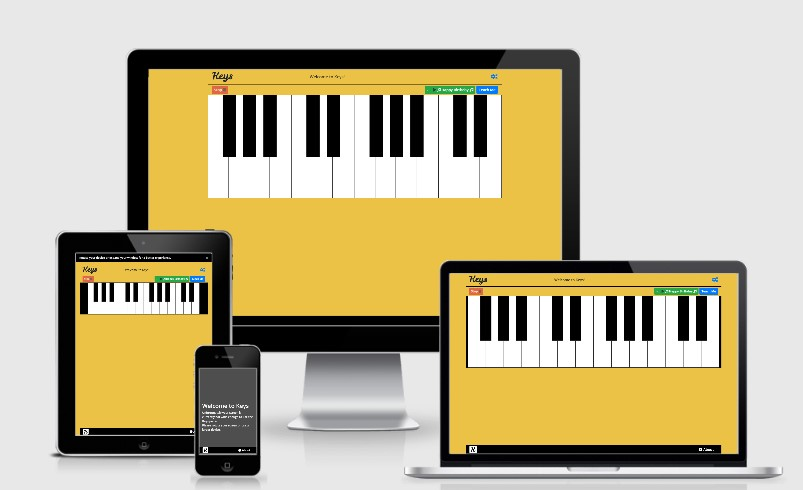

Keys is my second milestone project while studying at [The Code Institute](https://codeinstitute.net/).
The purpose of the milestone project is to present an interactive website built with HTML, CSS and Javascript.

Keys is a single webpage with an interactive keyboard built with Javascript with multiple features.

[Live Link to Site](https://trevbytes.github.io/Keys/)

## UX

This site was initially designed to teach the user simple tunes on the piano. The user would choose a song and the piano would play a note that the user would then play, this would repeat until the full tune is played.

The site is designed for mobile phones in landscape view. Keeping the layout of the site simple was crucial as to not confuse the user or overwhelm the user with options. When the piano is not useable or can be larger a prompt lets the use know what they can do to have a better user experience.

With a recording feature added, this site has evolved to also cater to users wanting to teach a song to another user.

The sites [wireframes](https://github.com/Trevbytes/Keys/blob/master/wireframes/keys-wireframe.pdf) show the original idea for the site. Design changes were made during the consturction of the site to keep the site clean and free from extensive text.

Bright colors were chosen to engage the user and highlight buttons.

All songs chosen in this project are in the Public Domain to avoid any issues with copywrites.

### User Stories

- A user wants to learn how to play simple tunes on the piano.
    - The user clicks on 'Teach Me' and follows along with the selected tune. 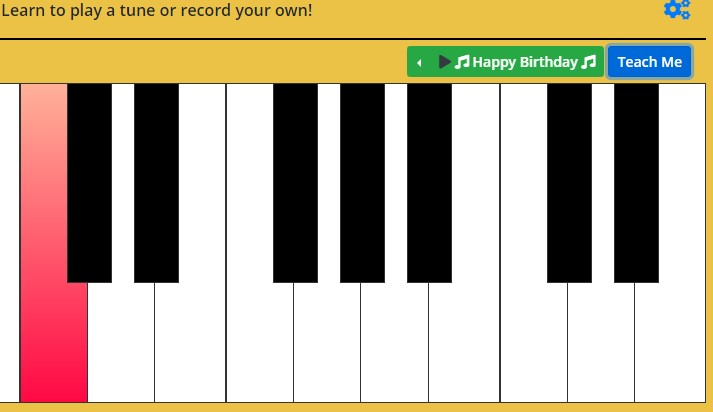
- A user wants to teach a friend a recorded tune on the piano.
    - The user clicks navigates to the record option, records a tune, then the friend clicks on 'Teach Me'. 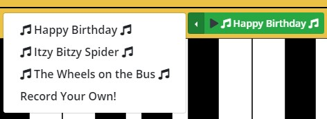 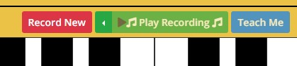 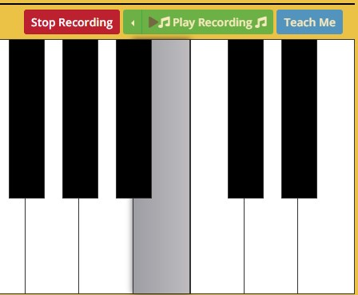 
- A music teacher wants to help a student learn.
    - The music teach could turn on the names of the keys in the settings button and then records a tune they want the student to learn. 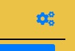 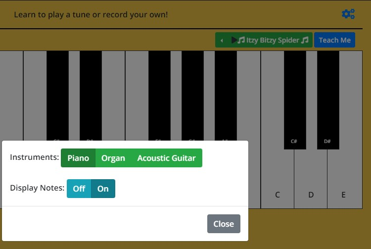
- A user wants to pass time by playing a simple piano.
    - The user could change the sound of the piano for even more fun while playing the piano. 
- A user is going to a Birthday party where there will be a piano. The user wants to impress people by playing Happy Birthday on the piano. The user can learn and practice the notes before hand on this website.
- A user is singing to a child and wants music to accompany. 
    - The user can play the songs from this website while singing or even have the child play/learn the song. 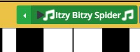
- A user starts the site, goes directly to the piano and is unsure what they can do with the piano. 
    - At any point the user is unsure what to do a user can click on the home button in the header or the Keys icon in the footer. This will return them to the landing page where they can read the instructions for the site.

    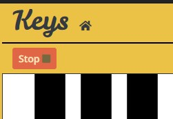  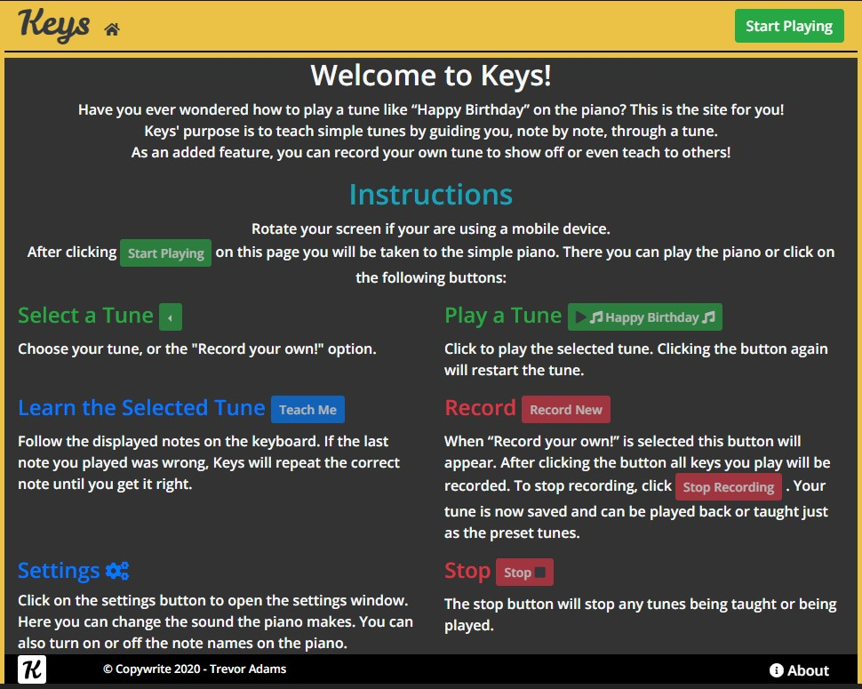
- A user wants to know more about the site.
    - The user clicks on the about button located in the footer.  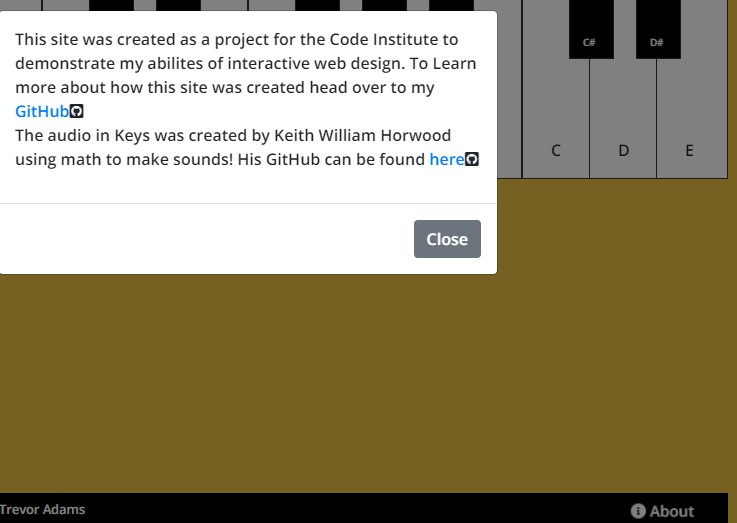
## Features

### Existing Features

- **Landing Page** - The landing page provides the user with a clear set of instructions of how to use the piano.
- **Play Tune** - Allows users to listen to the chosen tune, by having them click on the button with the tune name.
- **Teach Me** - Allows users to learn a tune, note by note. After the user clicks 'Teach Me' the first note of the tune is shown. If the last key pressed is the same as the note displayed the next note is shown. If not, the note being taught is repeated.
- **Record** - Allows users to create their own tune. This tune can also use the 'Teach Me' feature after the tune is recorded.
- **Settings** - A modal that allows users to choose between 3 instuments for the piano sounds as well as the option to show the names of the keys of the piano.
- **About** - A modal to provide info about the sound of the piano and give credit to Keith Horwood (The creator of the audio sounds) and a link to my GitHub.
- **Web Manifest** - This allows the website to be installed to a device’s homescreen without an app store. This is a progressive web app and is limited to your mobile browser's capabilty of this feature. The site can be downloaded in advance and can work offline.

### Features Left to Implement

- Add more inputs for the piano. Types of input could include: keyboard input, multi-touch input, ability to "drag" a finger or mouse over keys to play the notes (like a physical piano).
- Add a pause note in the songs. Currently songs are played back at set intervals with no rests or pauses between notes.

## Technologies Used

- [HTML 5](https://en.wikipedia.org/wiki/HTML5)

  - The project uses **HTML 5** to construct the website.

- [CSS 3](https://en.wikipedia.org/wiki/Cascading_Style_Sheets)

  - The project uses **CSS 3** to style the HTML elements.

- [Javascript](https://en.wikipedia.org/wiki/JavaScript)

  - The project uses **Javascipt** as the main source of interactivity in the website. It manipulates both the HTML and CSS elements of the site.

- [Bootstrap 4.4.1](https://getbootstrap.com/)

  - The project uses **Bootstrap** to create the layout of the site as well as style many of the elements, such as buttons.

- [JQuery](https://jquery.com)

  - The project uses **JQuery** to simplify DOM manipulation in my main javascript file.

- [Hover.css](https://ianlunn.github.io/Hover/)

  - The project uses **Hover.css** to create hover effects on buttons and keys.

- [Google Fonts](https://fonts.google.com/)

  - The project uses **Google Fonts** for fonts used in the website.

- [Font Awesome](https://fontawesome.com/icons?d=gallery)

  - The project uses **Font Awesome** for all icons in the website.

- [Favicon.io](https://favicon.io/)

  - The project uses **Favicon.io** to create favicon icons for the website.

- [CSS Gradient](https://cssgradient.io/)

  - The project used **CSS Gradient** to create gradient colors for active keys.

- [Balsamiq Wireframes](https://balsamiq.com/)

  - The project used **Balsamiq Wireframs** to create the initial wireframes.

- [Git](https://git-scm.com/)

  - The project uses **Git** for tracking changes in code during development.

- [GitPod](https://www.gitpod.io/)

  - The project used **GitPod** as the online IDE/workspace during development .

- [GitHub](https://github)

  - The project uses **GitHub** for hosting the webpage and the repository.

- [Chrome Developer Tools](https://developers.google.com/web/tools/chrome-devtools)

  - The project uses **Chrome Developer Tools** for debugging the webpage during development.

- [W3C Markup Validation Service](https://validator.w3.org)

  - The project uses **W3C Markup Validation** for validating code during development.

- [JShint](https://jshint.com/)

  - The project uses **JShint** for validating and improving JS code during development.

- [Am I Responsive](http://ami.responsivedesign.is/)
  - The ReadME used **Am I Responsive** for creating an image of the website on multiple displays to show responsiveness.

## Testing

This project has been tested for display responsiveness throughout development. I have tested the site in all display sizes in Chrome Dev Tools, Chrome, Firefox, Opera, Edge and Android devices.

All modern browsers are supported. Older browsers such as IE are not suppported due mainly to the use of the Audiosynth JS file and CSS variables used when creating the piano.

The testing and debugging of this project was doing extensively in Chrome Dev Tools. The process would typically go as follows:

- Create a function.
- Test that function and try to break the function using unexpected input and having friends and family test the function.
- Fix the bugs. During this project I learned how useful 'console.log' can be when trying to figure out why a function is not working as intended.
- Create next function.
- Repeat.

A testing framework such as [Jasmine](https://jasmine.github.io/) was not used as manual user testing was more appropriate for the interactivity required in this project.

All but one bug found during testing have been fixed. An interesting bug I can across was when a user would click on 'Teach Me' and then a note would repeat even after a user clicked on a key. I fixed this bug and learned an important lesson in user experience. A new user that knows nothing of the website is learning how the site works. When the new user clicked on 'Teach Me', the first note would be displayed. The first time the note was displayed the user typically did not click on any key. If a user already knew they needed to click on the key, they would click on it before it would repeat. If no input was given before the note repeated, the function would get stuck in a loop and not allow any user input. I learned about user learning and intuition during the testing of this site.

The known bug that has not been fixed can be replicated by clicking on the 'Record New' button, then clicking it again without clicking any keys. The Play Tune and Teach Me functions activate even though the array should be empty. 

Another interesting unintended feature was left in the site. When in the 'Teach Me' function a user can click as many keys as they want as long as the **last key** they played was correct. This was left and not fixed as this allows users to add flare to their tune, such as an extra note in Happy Birthday if the receiver of the Happy Birthday tune has a long name.

This project have been reviewed/tested by a senior web developer. A mentor provided by Code Institute during my studies.

This project has been peer reviewed/tested within Code Institute's Slack channel.

This project have been reviewed/tested by friends and family. This project has been texted extensively for interactivity.

Some of the main testing of features included:

- Cycle through songs and play each. Check that correct songs are played and taught.
- Cycle through instrument choices and adjust note length so that the audio sounds alright on all instruments.
- Checked that the text for notes were properly displayed on all screen sizes.
- Checked that the recording feature was intuitive. Buttons are disabled if they do nothing and enabled when usable.
- Checked that a recorded song is saved until recorded over(or website is refreshed), even when changing songs or pressing 'stop'.

- The HTML and CSS code has been validated by [W3C Markup Validation Service](https://validator.w3.org) and [JShint](https://jshint.com/)

## Deployment

This project is hosted on GitHub Pages with the [master branch](https://trevbytes.github.io/Keys/) deployed.

Hosting a page from GitHub is as simple as locating the settings button at the top of your repository, clicking on it, then scrolling down to the GitHub Pages section. Here, under source, you can select the branch that GitHub Pages will Host

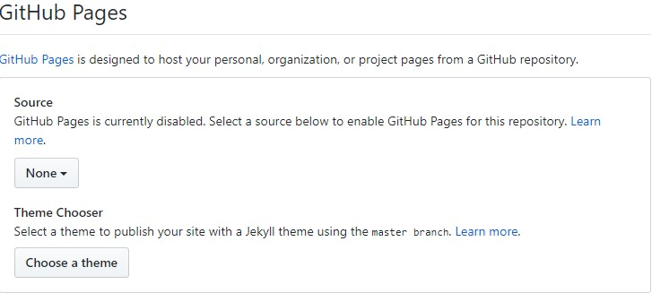

The GitHub Repository can be found [here](https://github.com/Trevbytes/Keys).

For infomation on how to clone or download the repository click [here](https://help.github.com/en/github/creating-cloning-and-archiving-repositories/cloning-a-repository).

## Credits

### Media

- The audiosynth.js file used in this project was created by Keith William Horwood. He has created an audio synthesizer using math in javascript. All sounds created in this project use this code. More info about his file can be found [here](https://keithwhor.com/music/). His GitHub can be found [here](https://github.com/keithwhor/audiosynth).

### Acknowledgements

- I received inspiration/help for the [piano](https://www.youtube.com/watch?v=vjco5yKZpU8) and [recording function](https://www.youtube.com/watch?v=d0-VH4MC0Rk) in this project from YouTube tutorials by Kyle.
- Help for the initial code of adding and removing an 'active' class to piano keys is credited to a [gist](https://gist.github.com/doubleedesign/08f89ad1c4f0ba73ffdbc727136da190) by Lessa Ward.
- When stuck with coding issues, I used the following sites to help understand/solve the issues: [W3schools](https://www.w3schools.com/),[StackOverflow](https://stackoverflow.com/),[MDN](https://developer.mozilla.org/en-US/)
